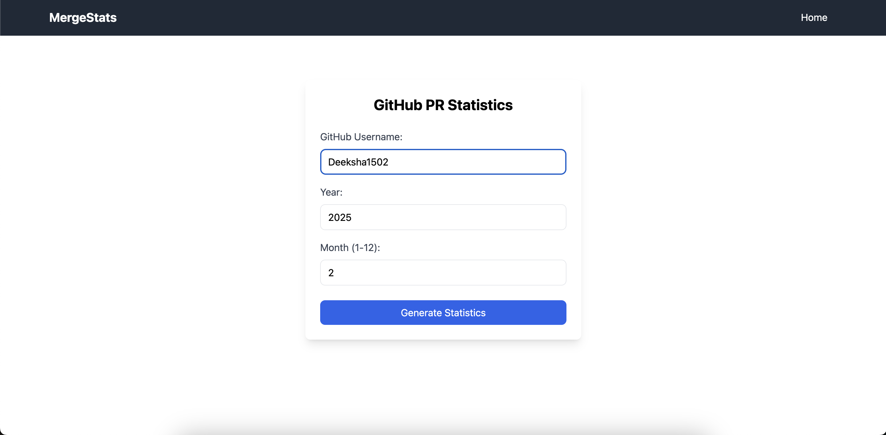
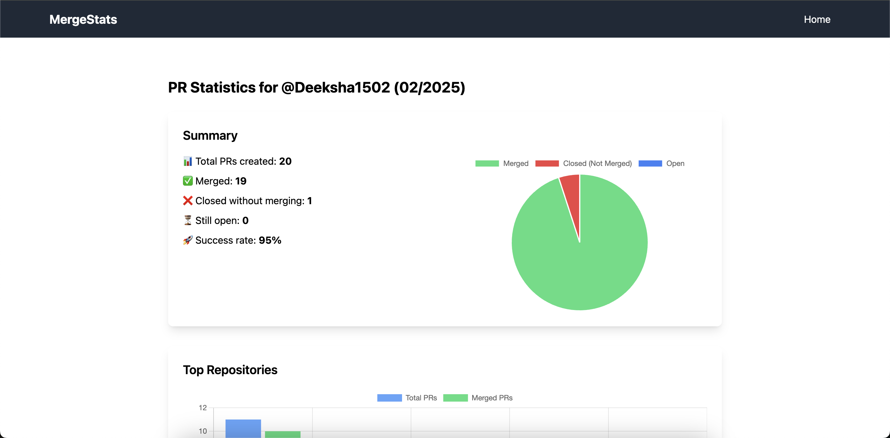
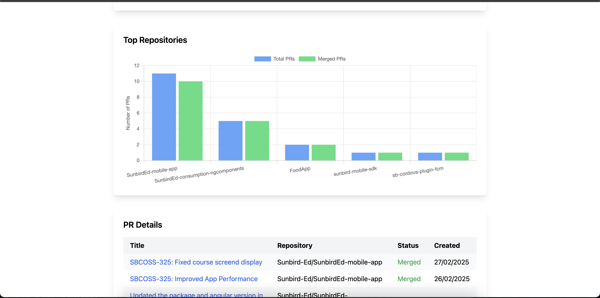

# 📊 MergeStats

**MergeStats** is a GitHub Pull Request analytics tool that helps you track and visualize your PR statistics across repositories.

---

## ✨ Features
- View PR statistics for your repositories
- Filter by month and year
- See top repositories by PR count
- View merged vs. closed PR statistics
- Detailed PR list with status and timestamps


---

### 🔧 Prerequisites

- Node.js (v14+)
- npm 

---

## ⚙️ Setup Instructions

1. Clone the repository
```bash
git clone https://github.com/yourusername/MergeStats.git
cd MergeStats
```

2. Install backend dependencies
```bash
npm install
```

3. Create .env file in the root directory
```bash
touch .env
```

---


Create a GitHub personal access token (classic):

1. Go to GitHub → Settings → Developer settings

2. Click on Personal Access Tokens → Tokens (classic)

3. Click Generate new token (classic)

4. Add a name and expiration date

5. No scopes are required for public repo access

6. Click Generate token

7. Copy the token and add it to your .env file:

```bash
GITHUB_TOKEN=your_token_here
```

---
 Open a new terminal 
```bash
cd mergestats-ui
```

 Install frontend dependencies
```bash
npm install
```
## 🚀 Running the App
In the root directory
```bash
npm start
```
The server will run on http://localhost:3000

## Start the frontend
 In the mergestats-ui directory
```bash
npm run dev 
```
The frontend will run on http://localhost:5173 (or another port if 5173 is in use)

---

## 📌  Usage
1. Enter a GitHub username
2. Select the year and month
3. Click "Generate Statistics"
4. View the PR statistics and visualizations

## 🧰 Technical Details
1. Backend: Node.js with Express
2. Frontend: React with TypeScript and Tailwind CSS
3. Charts: Chart.js
4. API: GitHub REST API

## 🖼️ Screenshots

### 📊 Dashboard View







